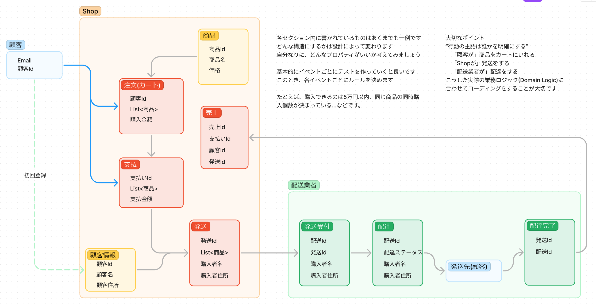
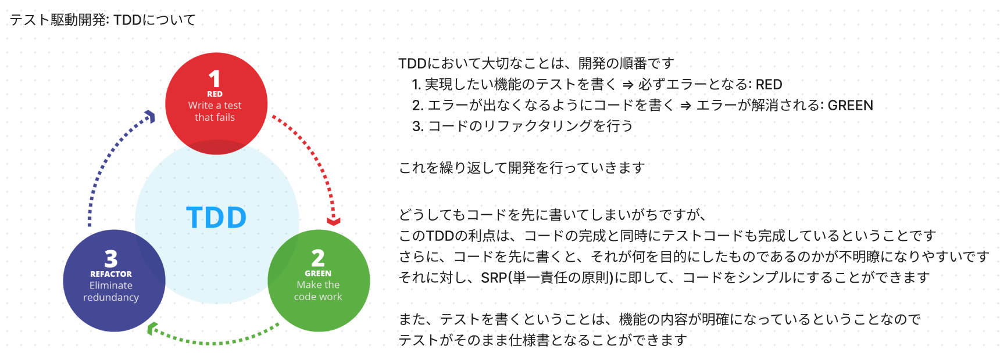

# テスト駆動開発の練習用

## 内容

業務フロー

いわゆる一般的な購買処理です
これを全部開発する必要はありませんが、自分が理解しやすいところから取り掛かるといいでしょう

## テスト駆動開発について

## CustomerRepositorySampleTestについて
TDDの理解のためにBranchを使用してテスト駆動の手順を示しています

基本的にBranch名で手順を示していきます

例)

1. Branch名: customer-create ---> 最初に作るアーキテクチャ
2. Branch名: customer-01 ---> ステップ1
3. Branch名: customer-02 ---> ステップ2

だいたいこんな感じでブランチを作成していきます
最新はmainとなる感じです

## 各プロジェクトについて
DDDのフロントを除いた3層レイヤー構造にしています。
ビジネスロジックはDomainに、DBはRepository、APIがアプリケーション層となっています。

本来的にはDomain層を開発するのがいいかもしれませんが、慣れていない場合は、上の例にあるように、Repository層をTDDで作成するのがいいと思います。

慣れてきたら、Domain層を開発するのがいいですが、個の場合RepositoryはMoqなどを使用してモック化するのがよいと思います。

最後にアプリケーション層でモックを使用してのTDD開発です。

そして、すべての単体テストが作成で来たら、次はIntegration(or Functional)テスト作成となりますが、基本的にはAPIからMockを使用せずに作るか、それともRepositoryはMockにするかどちらかで作ることになります。
